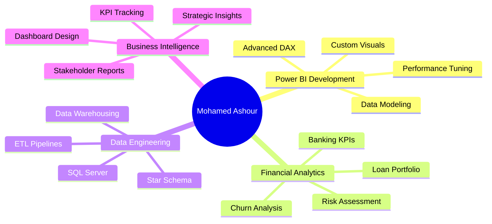

<!-- Animated Welcome Banner -->
<div align="center">
  
</div>

<!-- Centered, animated headline -->
<p align="center">
  
</p>

<!-- Animated badges with icons -->
<p align="center">
  <a href="https://mohamedashour1093.github.io/portfolio/">
    
  </a>
  <a href="https://www.linkedin.com/in/mohamed-ashour-mohamed/">
    
  </a>
  <a href="mailto:mohamedashour1093@gmail.com">
    
  </a>
  
</p>

<!-- Tech Stack with animated glow effect -->
<p align="center">
  
  
  
  
  
  
</p>

---

<!-- Animated GIF beside content -->


### 👨‍💼 About Me

```python
class BISpecialist:
    def __init__(self):
        self.name = "Mohamed Ashour"
        self.role = "BI Specialist | Power BI Developer"
        self.company = "NCR Corporation"
        self.experience = "2+ years"
        self.location = "Egypt"
        
    def skills(self):
        return {
            "BI_Tools": ["Power BI", "DAX", "Power Query"],
            "Databases": ["SQL Server", "T-SQL", "Star Schema"],
            "Languages": ["Python", "SQL", "M Language"],
            "Libraries": ["Pandas", "NumPy", "Matplotlib"],
            "Expertise": ["Financial KPIs", "ETL Pipelines", 
                         "Data Modeling", "Dashboard Design"]
        }
    
    def current_focus(self):
        return ["Advanced DAX Patterns", "Real-time Dashboards",
                "Financial Analytics", "Predictive Modeling"]

me = BISpecialist()
print(f"💼 {me.role} @ {me.company}")
```

<br clear="right"/>

---

### 🎯 Core Competencies

<table>
<tr>
<td width="50%" valign="top">

#### 📊 Business Intelligence
- ✅ Power BI Dashboard Development
- ✅ Advanced DAX & Time Intelligence
- ✅ Data Modeling (Star/Snowflake Schema)
- ✅ KPI Tracking & Performance Metrics
- ✅ Report Optimization & RLS

</td>
<td width="50%" valign="top">

#### 💹 Financial Analytics
- ✅ Banking KPIs (NPL, ROA, ROE)
- ✅ Loan Portfolio Analysis
- ✅ Customer Segmentation & Churn
- ✅ Transaction Pattern Analysis
- ✅ Risk Assessment Dashboards

</td>
</tr>
</table>

---

### 🚀 Featured Projects

<table>
<tr>
<td width="50%">

#### 🏦 [Bank Loan Portfolio Analysis](https://github.com/MohamedAshour1093/Bank-Loan-Report)


**Key Metrics:** NPL, ROA/ROE, Delinquency Rates  
**Impact:** Comprehensive risk assessment with MTD/MoM tracking  
**Tech:** Advanced DAX time intelligence, dimensional modeling

</td>
<td width="50%">

#### 💳 [ATM Transaction Analytics](https://github.com/MohamedAshour1093/Wisabi-Bank-ATM-Transaction-)


**Key Metrics:** Uptime 99.7%, Regional Performance  
**Impact:** Operational insights & cost optimization  
**Tech:** Star schema, ETL pipelines, interactive dashboards

</td>
</tr>
<tr>
<td width="50%">

#### 📈 [Financial Consumer Analytics](https://github.com/MohamedAshour1093/Financial-Consumer-Analysis)


**Key Metrics:** Customer Segmentation, Churn Analysis  
**Impact:** Identified 70% high-value segment, 4.8/5 satisfaction  
**Tech:** Python EDA, statistical analysis, BI integration

</td>
<td width="50%">

#### 🛒 [E-Commerce Analysis (EasyShop)](https://github.com/MohamedAshour1093/EasyShop_analysis)


**Key Metrics:** 68% Conversion Drop Analysis  
**Impact:** Root cause identification & ROI optimization  
**Tech:** NLP sentiment analysis, comprehensive BI solution

</td>
</tr>
</table>

---

### 📊 GitHub Analytics

<p align="center">
  
  
</p>

<p align="center">
  
  
</p>

---

### 🏆 GitHub Trophies

<p align="center">
  
</p>

---

### 💼 Professional Highlights

<div align="center">

| 🎯 Metric | 📈 Achievement |
|-----------|----------------|
| **Experience** | 2+ Years @ NCR Corporation |
| **Dashboards Created** | 15+ Production Dashboards |
| **Projects Completed** | 20+ BI & Analytics Projects |
| **Technologies** | Power BI, SQL, Python, DAX |
| **Industries** | Banking, E-commerce, Finance |
| **KPIs Tracked** | 50+ Financial & Operational Metrics |

</div>

---

### 🛠️ Technical Arsenal

<div align="center">

#### Business Intelligence & Data Visualization


#### Programming & Analysis


#### Database & ETL


#### Tools & Platforms


</div>

---

### 🎓 Expertise Areas



---

### 📫 Let's Connect & Collaborate!

<div align="center">

[](https://mohamedashour1093.github.io/portfolio/)
[](https://www.linkedin.com/in/mohamed-ashour-mohamed/)
[](mailto:mohamedashour1093@gmail.com)
[](https://github.com/MohamedAshour1093)

</div>

---

### 💡 Random Dev Wisdom

<div align="center">


</div>

---

### 🐍 Contribution Snake

<div align="center">
  


</div>

---

<div align="center">

### ⚡ "Turning Data into Decisions, One Dashboard at a Time" ⚡

**💼 Open to BI Specialist & Power BI Developer Opportunities 💼**


</div>
